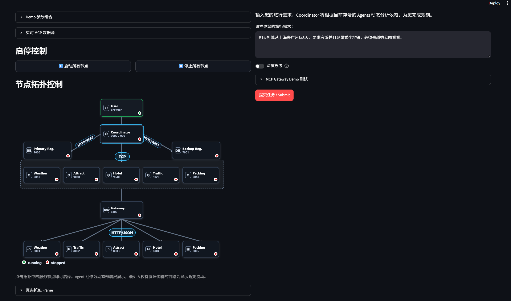

# 操作手册

本文档只说明两种启动方式：`demo_ui` 图形界面启动、命令行启动。组件细节见设计文档。

## 1. 准备环境

在仓库根目录执行：

```powershell
uv sync
```

建议先设置中文输出：

```powershell
$env:PYTHONIOENCODING="utf-8"
$env:PYTHONUTF8="1"
```

使用 LLM 和实时数据时，在 `.env` 中配置模型与数据源密钥，然后设置：

```powershell
$env:A2A_USE_LLM="1"
$env:A2A_REALTIME_MCP_ENABLED="true"
```

无实时MCP API / 离线演示可设置：

```powershell
$env:A2A_USE_LLM="0"
$env:A2A_REALTIME_MCP_ENABLED="false"
```

## 2. demo_ui 启动方式

启动主界面：

```powershell
uv run streamlit run scripts\demo_ui.py
```

浏览器打开 Streamlit 输出的地址。



进入页面后的操作顺序：

1. 点击“启动所有节点”。
2. 等待拓扑图节点进入运行状态。
3. 在任务输入框填写旅行需求。
4. 点击提交任务。
5. 查看拓扑流转、网络事件、报文详情和最终旅行方案。
6. 演示结束后点击“停止所有节点”。

示例任务：

```text
请帮我规划从上海去杭州的三天旅行计划，预算适中，想去西湖和灵隐寺，尽量使用地铁和步行。
```

## 3. 命令行启动方式

使用批处理脚本启动完整后端：

```powershell
.\start_all.bat llm
```

不调用外部模型时：

```powershell
.\start_all.bat no-llm
```

也可以直接使用 Python 启动脚本：

```powershell
uv run python scripts\start_all.py --mode llm
```

或：

```powershell
uv run python scripts\start_all.py --mode no-llm
```

停止服务：在启动窗口按 `Ctrl+C`。

## 4. 常用命令行演示

正常端到端任务：

```powershell
uv run python scripts\demo_normal.py
```

Weather MCP 缺失场景：

```powershell
uv run python scripts\demo_fault.py
```

MCP 响应延迟场景：

```powershell
uv run python scripts\demo_mcp_delay.py
```

主备注册中心切换场景：

```powershell
uv run python scripts\demo_backup_registry.py
```

A2A ACK 延迟场景：

```powershell
uv run python scripts\demo_ack_delay.py
```

实时数据接口检查：

```powershell
uv run python scripts\test_realtime_mcp.py
```

## 5. 推荐演示流程

1. 先运行 `uv run streamlit run scripts\demo_ui.py`。
2. 在 UI 中启动全部节点并提交示例任务。
3. 展示拓扑图、网络事件表和报文详情。
4. 再运行一个命令行 demo，对比 UI 演示和脚本输出。
