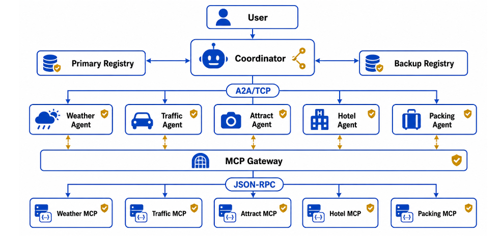
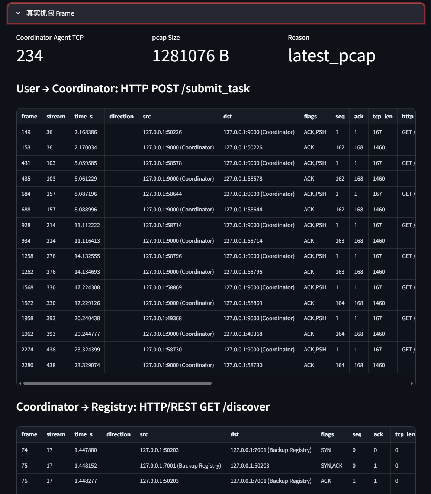
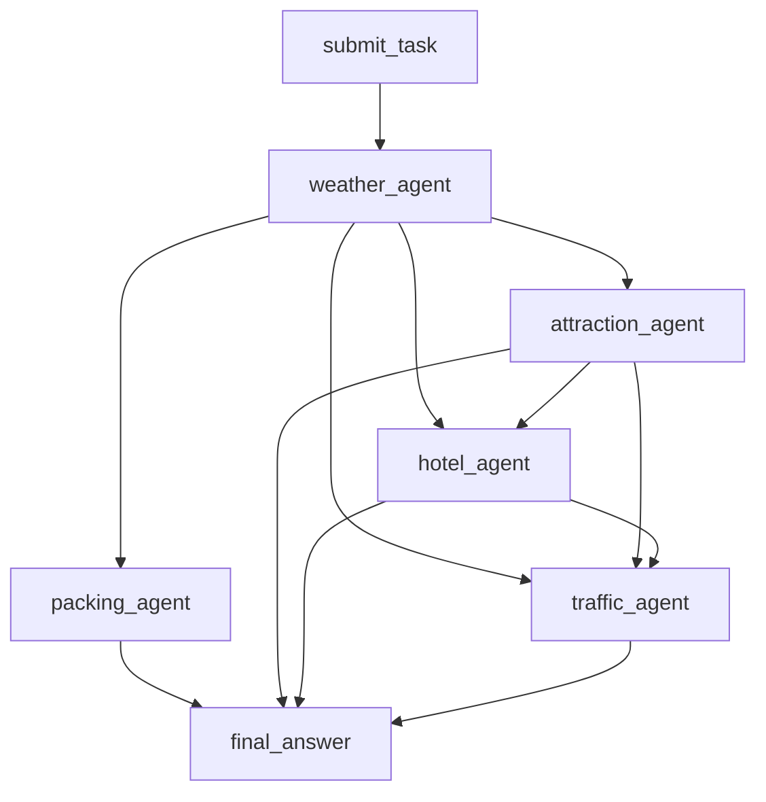

# 设计文档

本文档按“通信拓扑 -> TCP A2A JSON 字典 -> HTTP A2A JSON 字典 -> 项目要点”组织。

## 1. 通信拓扑图



核心通信关系：

| 链路 | 协议 | 内容 |
|---|---|---|
| UI/User -> Coordinator | HTTP JSON | 提交任务、查询任务 |
| Coordinator -> Registry | HTTP REST | Agent 服务发现 |
| Agent -> Registry | HTTP REST | 注册、心跳 |
| Coordinator -> Agent | A2A TCP | 发送 `TASK_REQUEST` |
| Agent -> Coordinator | A2A TCP | 回传 `TASK_RESULT` |
| Agent -> MCP Gateway | HTTP JSON-RPC | 调用领域工具 |
| Gateway -> MCP Server | HTTP JSON-RPC | 按 method 转发 |
| 组件 -> 日志 | JSONL | 记录网络事件和执行状态 |

进程与端口：

| 进程 | 端口 | 协议/入口 | 作用 |
|---|---:|---|---|
| demo_ui | 8504 | Streamlit HTTP | 主演示界面 |
| Primary Registry | 7000 | HTTP | 主注册中心 |
| Backup Registry | 7001 | HTTP | 备用注册中心 |
| Weather MCP | 8001 | HTTP JSON-RPC | 天气工具 |
| Traffic MCP | 8002 | HTTP JSON-RPC | 交通工具 |
| Attraction MCP | 8003 | HTTP JSON-RPC | 景点工具 |
| Hotel MCP | 8004 | HTTP JSON-RPC | 酒店工具 |
| Packing MCP | 8005 | HTTP JSON-RPC | 行李工具 |
| MCP Gateway | 8100 | HTTP JSON-RPC | MCP 统一入口 |
| Coordinator HTTP | 9000 | HTTP JSON | 用户任务入口 |
| Coordinator A2A TCP | 9001 | TCP | Agent 结果回调 |
| Weather Agent | 9010 | A2A TCP | 天气 Agent |
| Traffic Agent | 9020 | A2A TCP | 交通 Agent |
| Attraction Agent | 9030 | A2A TCP | 景点 Agent |
| Hotel Agent | 9040 | A2A TCP | 酒店 Agent |
| Packing Agent | 9060 | A2A TCP | 行李 Agent |

## 2. TCP A2A JSON 字典

### 2.1 Frame 格式

TCP 无天然消息边界，因此 A2A TCP 使用 length-prefix frame。



```text
+------------------------+--------------------------+
| 4-byte big-endian len  | UTF-8 JSON envelope body |
+------------------------+--------------------------+
```

实现位置：`common/tcp_a2a.py`。

### 2.2 Envelope

每个 TCP frame 的 body 都是 JSON envelope。

```json
{
  "version": "1.0",
  "type": "TASK_REQUEST",
  "trace_id": "trace-<task_id>",
  "span_id": "span-coordinator-dispatch-weather_agent",
  "parent_span_id": null,
  "source": "coordinator",
  "target": "weather_agent",
  "task_id": "<task_id>",
  "deadline_ms": 120000,
  "payload": {}
}
```

| 字段 | 类型 | 必填 | 说明 |
|---|---|---|---|
| `version` | string | 是 | 当前为 `1.0` |
| `type` | string | 是 | frame 类型 |
| `trace_id` | string | 是 | 端到端追踪 ID |
| `span_id` | string | 是 | 当前通信片段 ID |
| `parent_span_id` | string/null | 否 | 父片段 ID |
| `source` | string | 是 | 发送方 |
| `target` | string | 是 | 接收方 |
| `task_id` | string | 是 | 任务 ID |
| `deadline_ms` | integer/null | 否 | 任务剩余时间预算 |
| `payload` | object | 是 | 业务数据 |

### 2.3 Frame 类型

| 类型 | 方向 | 说明 |
|---|---|---|
| `TASK_REQUEST` | Coordinator -> Agent | 派发任务 |
| `TASK_ACK` | Agent -> Coordinator | 确认收到任务 |
| `TASK_RESULT` | Agent -> Coordinator | 回传执行结果 |
| `RESULT_ACK` | Coordinator -> Agent | 确认收到结果 |
| `ERROR` | 任意方向 | 协议错误或拒绝 |

### 2.4 `TASK_REQUEST.payload`

```json
{
  "source": "coordinator",
  "target": "weather_agent",
  "task_id": "<task_id>",
  "instruction": "用户原始旅行规划问题",
  "context": {
    "workflow": "travel_dependency",
    "node_id": "weather_agent",
    "dependencies": [],
    "travel_task": {},
    "inputs": {
      "upstream_results": {}
    },
    "trace_id": "trace-<task_id>",
    "parent_span_id": "span-coordinator-dispatch-weather_agent"
  },
  "reply_to": "tcp://127.0.0.1:9001",
  "created_at": "2026-06-23T00:00:00+00:00"
}
```

| 字段 | 说明 |
|---|---|
| `instruction` | 原始用户问题 |
| `context.workflow` | 当前工作流名称 |
| `context.node_id` | 当前 DAG 节点 |
| `context.dependencies` | 依赖节点列表 |
| `context.travel_task` | Coordinator 解析后的旅行任务结构 |
| `context.inputs.upstream_results` | 上游 Agent 结果 |
| `reply_to` | Agent 回调地址 |

### 2.5 `TASK_RESULT.payload`

```json
{
  "source": "weather_agent",
  "target": "coordinator",
  "task_id": "<task_id>",
  "status": "success",
  "result": "天气 Agent 摘要文本",
  "error": null,
  "metadata": {
    "agent": "weather_agent",
    "capability": "weather",
    "mcp_server": "weather_mcp_server",
    "mcp_method": "get_weather",
    "mcp_gateway": "mcp_gateway",
    "mcp_result": {},
    "structured_result": {},
    "elapsed_ms": 123.45
  }
}
```

| 字段 | 说明 |
|---|---|
| `status` | `success` 或 `error` |
| `result` | 给 Coordinator 汇总使用的结果 |
| `error` | 失败原因，成功时为 `null` |
| `metadata` | MCP 原始返回、结构化结果、耗时、质量信息 |

### 2.6 ACK / ERROR Payload

`TASK_ACK`：

```json
{
  "accepted": true,
  "agent": "weather_agent",
  "task_id": "<task_id>"
}
```

`RESULT_ACK`：

```json
{
  "received": true,
  "task_id": "<task_id>",
  "task_status": "completed"
}
```

`ERROR`：

```json
{
  "error": "unexpected result source: traffic_agent",
  "code": "invalid_source",
  "retry_after_ms": null
}
```

## 3. HTTP A2A JSON 字典

HTTP 主要承担用户入口、任务查询、兼容 Agent 入口、兼容结果回调和服务发现。

### 3.1 `POST /submit_task`

请求：

```json
{
  "question": "请帮我规划从上海去北京的五天低预算旅行计划",
  "timeout": 120,
  "async": true
}
```

响应：

```json
{
  "ok": true,
  "task": {
    "task_id": "<task_id>",
    "status": "pending",
    "question": "请帮我规划从上海去北京的五天低预算旅行计划"
  }
}
```

### 3.2 `GET /tasks?task_id=<task_id>`

响应：

```json
{
  "ok": true,
  "task": {
    "task_id": "<task_id>",
    "status": "completed",
    "final_answer": "最终旅行方案",
    "results": {},
    "dispatch_errors": {}
  }
}
```

### 3.3 Agent HTTP 兼容入口

`POST /execute_task` 的 body 与 `TASK_REQUEST.payload` 相同。当前主派发链路使用 TCP。

`POST /task_result` 的 body 与 `TASK_RESULT.payload` 相同。当前主结果链路使用 TCP。

### 3.4 Registry JSON

`POST /register`：

```json
{
  "agent_name": "weather_agent",
  "host": "127.0.0.1",
  "port": 9010,
  "protocol": "tcp",
  "execute_path": "/execute_task",
  "enabled": true,
  "capabilities": ["weather.query", "weather.forecast"],
  "keywords": ["weather", "forecast", "天气"]
}
```

`GET /discover`：

```json
{
  "ok": true,
  "agents": {
    "weather_agent": {
      "agent_name": "weather_agent",
      "host": "127.0.0.1",
      "port": 9010,
      "protocol": "tcp",
      "enabled": true,
      "capabilities": ["weather.query", "weather.forecast"],
      "status": "healthy"
    }
  }
}
```

### 3.5 MCP JSON-RPC

Agent 调 MCP Gateway，Gateway 再转发给 MCP Server。请求格式如下：

```json
{
  "jsonrpc": "2.0",
  "id": "<task_id>",
  "method": "search_attractions",
  "params": {
    "city": "北京",
    "days": 3,
    "budget_level": "low",
    "must_visit": ["故宫"]
  }
}
```

成功响应：

```json
{
  "jsonrpc": "2.0",
  "result": {
    "city": "北京",
    "spots": []
  },
  "id": "<task_id>"
}
```

错误响应：

```json
{
  "jsonrpc": "2.0",
  "error": {
    "code": -32003,
    "message": "Upstream MCP request failed: timed out"
  },
  "id": "<task_id>"
}
```

常用 method：

| method | MCP Server | 作用 |
|---|---|---|
| `get_weather` | Weather MCP | 查询天气 |
| `search_attractions` | Attraction MCP | 搜索景点 |
| `search_hotels` | Hotel MCP | 搜索住宿 |
| `get_routes` | Traffic MCP | 查询市内路线 |
| `get_intercity_transport` | Traffic MCP | 查询城际交通 |
| `get_packing_list` | Packing MCP | 生成行李清单 |

## 4. 项目其他事项要点

### 4.1 MCP Gateway

`mcp_gateway.py` 是 Agent 到 MCP Server 的统一入口。

| 能力 | 设计体现 |
|---|---|
| 方法路由 | 根据 JSON-RPC `method` 选择上游 MCP Server |
| 缓存 | 对稳定查询结果按 method + params 缓存 |
| 请求合并 | 并发相同请求共用一次上游调用 |
| 背压 | 限制每类 method 的并发上游请求 |
| 熔断 | 连续失败后短时间快速返回错误 |
| 可观测性 | 提供 `/metrics`、`/methods`、`/cache`，并写入事件日志 |

Gateway 的边界很明确：它不改变业务语义，只负责路由和网络治理。

### 4.2 DAG 调度

Coordinator 将旅行任务拆成 DAG，并按依赖顺序调度 Agent。



DAG 设计要点：

- `weather_agent` 先给天气约束，供景点、行李、交通参考。
- `attraction_agent` 生成每日景点骨架。
- `hotel_agent` 根据景点分布选择住宿区域。
- `traffic_agent` 在景点和住宿确定后生成路线。
- Coordinator 聚合各 Agent 结果，生成最终回答。

### 4.3 容错设计在组件中的体现

| 组件 | 设计体现 |
|---|---|
| Coordinator | 记录派发失败、回调超时、Agent 错误结果；最终聚合为 `completed`、`partial` 或 `failed` |
| Agent | MCP 调用设置超时；异常转换为标准 `TASK_RESULT status="error"` |
| Registry | 主备注册中心；Coordinator 可切换到备用发现结果 |
| MCP Gateway | 超时、背压、熔断、请求合并，隔离上游 MCP 故障 |
| A2A TCP | length-prefix frame 处理粘包和拆包；非法 envelope 返回 `ERROR` |
| 日志系统 | 关键通信事件写入 `logs/demo_log.jsonl`，供 UI 展示链路和报文 |

典型故障传播：

```text
MCP Server 超时或不可用
-> Gateway 返回 JSON-RPC error
-> Agent 转换为 TASK_RESULT status="error"
-> Coordinator 继续等待其他可执行节点
-> 最终任务状态变为 partial 或 failed
```

### 4.4 代码模块对应

| 模块 | 说明 |
|---|---|
| `coordinator.py` | HTTP API、A2A TCP 回调、DAG 调度、结果汇总 |
| `agents/` | Weather、Attraction、Hotel、Traffic、Packing Agent |
| `mcp_servers/` | 各领域 MCP JSON-RPC 工具 |
| `mcp_gateway.py` | MCP 统一网关 |
| `registry_center.py` | 主/备注册中心 |
| `common/tcp_a2a.py` | TCP A2A frame 协议 |
| `common/schemas.py` | 任务请求和任务结果结构 |
| `scripts/demo_ui.py` | Streamlit 演示界面 |
| `scripts/start_all.py` | 本地多进程启动入口 |
