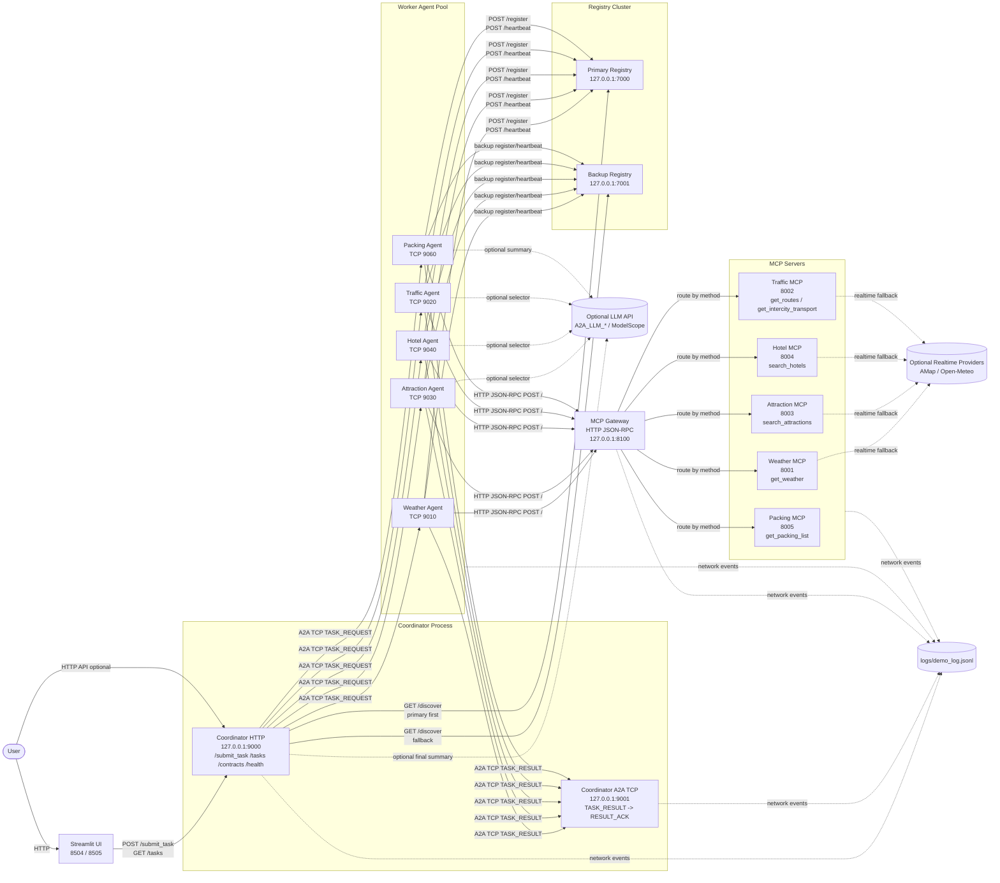
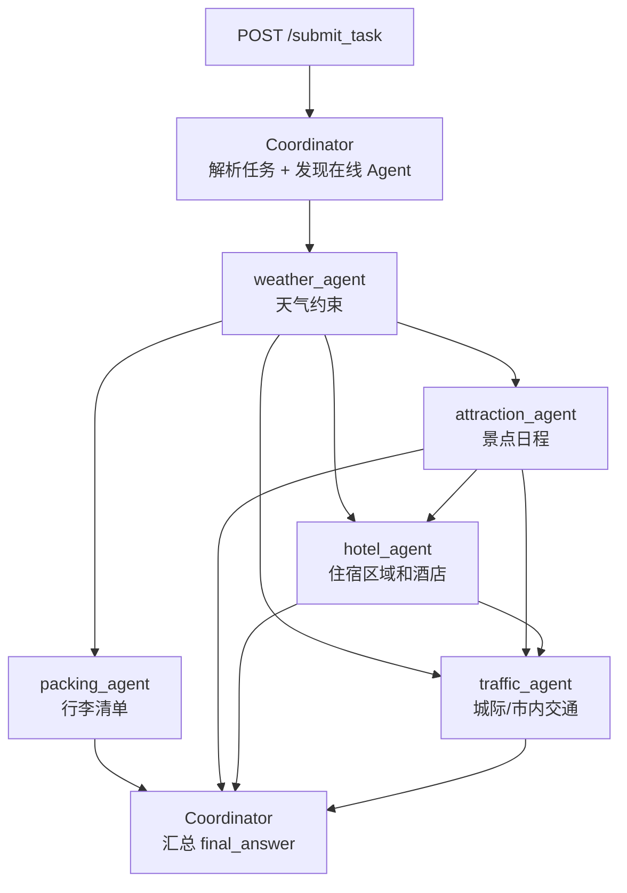
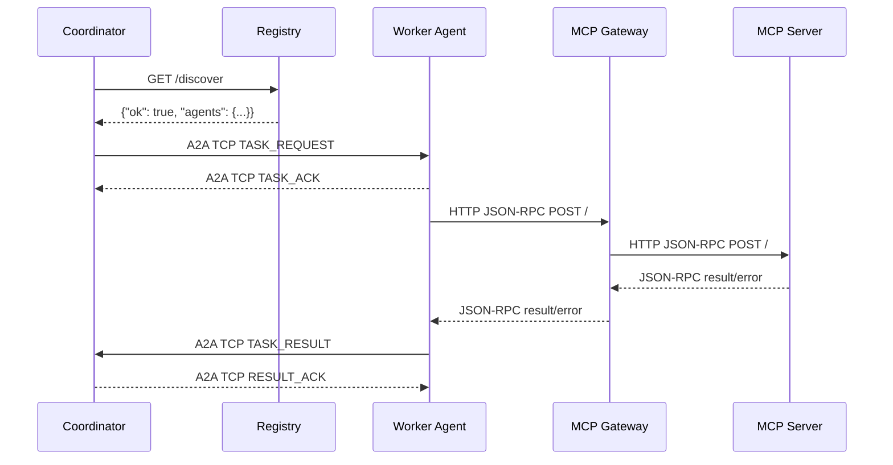

# 设计文档

本文档整理当前项目的代码结构、运行进程、系统进程通信网络拓扑，以及 Coordinator 与 Worker Agent 之间的 A2A TCP JSON 格式字典。

## 代码结构总览

本项目是一个本地多进程 A2A/MCP 协作系统，代码按“调度核心、Agent 执行层、MCP 工具服务层、公共协议与配置、演示脚本/UI、测试与文档”划分。

```text
Agent-collaboration-network-on-A2A-MCP/
├── coordinator.py                  # Coordinator：HTTP API、任务 DAG、Agent 发现、A2A TCP 调度与结果汇总
├── registry_center.py              # 主/备 Registry：Agent 注册、心跳、服务发现与健康查询
├── mcp_gateway.py                  # MCP Gateway：统一 JSON-RPC 入口、路由、缓存、限流、熔断与 metrics
├── llm_client.py                   # OpenAI-compatible / ModelScope LLM 客户端封装
├── common/                         # 跨进程共享基础设施
│   ├── config.py                   # 端口、超时、实时数据源、LLM 等运行配置
│   ├── tcp_a2a.py                  # A2A TCP length-prefix JSON frame 协议实现
│   ├── schemas.py                  # 任务、Agent、MCP 等共享数据结构
│   ├── http_client.py              # HTTP 调用辅助
│   ├── logger.py                   # JSONL 网络事件日志
│   ├── runtime.py                  # llm/no-llm 运行模式配置
│   └── internal_values.py          # 内部常量与默认值
├── agents/                         # Worker Agent 层
│   ├── base_agent.py               # Agent 注册、心跳、A2A TCP 服务、MCP 调用通用逻辑
│   ├── request_parser.py           # 用户旅行需求解析
│   ├── weather_agent.py            # 天气约束 Agent
│   ├── traffic_agent.py            # 城际/市内交通 Agent
│   ├── attraction_agent.py         # 景点规划 Agent
│   ├── hotel_agent.py              # 住宿推荐 Agent
│   └── packing_agent.py            # 行李清单 Agent
├── mcp_servers/                    # 领域 MCP Server 层
│   ├── base_mcp_server.py          # HTTP JSON-RPC MCP Server 基类
│   ├── weather_mcp_server.py       # 天气工具
│   ├── traffic_mcp_server.py       # 路线与交通工具
│   ├── attraction_mcp_server.py    # 景点搜索工具
│   ├── hotel_mcp_server.py         # 酒店搜索工具
│   ├── packing_mcp_server.py       # 行李建议工具
│   ├── mock_data.py                # 离线 Mock 数据
│   ├── realtime/                   # AMap / Open-Meteo 实时数据接入与归一化
│   └── enrichment/                 # 本地画像补全数据
├── scripts/                        # 启动、演示和 UI
│   ├── start_all.py                # 按依赖顺序启动全部本地服务
│   ├── demo_ui.py                  # 主 Streamlit Web UI：拓扑、节点启停、任务提交、报文查看
│   ├── ablation_ui.py              # 消融实验 Streamlit Web UI
│   ├── demo_*.py                   # 正常链路、故障、延迟、主备 Registry、缓存等命令行演示
│   ├── topology_component/         # Streamlit 拓扑自定义组件 HTML
│   └── packet_component/           # Streamlit 报文查看自定义组件 HTML
├── tests/                          # 协议与任务解析测试
├── docs/                           # 系统设计、协议、容错、网关说明与课程材料
├── logs/                           # 运行期 JSONL 事件日志与抓包输出
├── start_all.bat                   # Windows 一键启动入口
├── pyproject.toml                  # uv/Python 依赖声明
├── requirements.txt                # pip 依赖列表
└── README.md                       # 快速启动、演示流程与端口说明
```

从调用关系看，`coordinator.py` 是任务入口和调度中心；`agents/` 中的 Worker Agent 通过 `common/tcp_a2a.py` 定义的 A2A TCP 协议接收任务，再通过 `mcp_gateway.py` 调用 `mcp_servers/` 中的领域工具。`registry_center.py` 提供服务发现能力，`common/logger.py` 将关键网络事件写入 `logs/demo_log.jsonl`，供 UI 展示拓扑流动和协议报文。

UI 可以作为本地网站运行，但它不是纯静态网站。`scripts/demo_ui.py` 和 `scripts/ablation_ui.py` 是 Streamlit Web 应用，需要由 Python/Streamlit 进程托管；`scripts/topology_component/index.html` 与 `scripts/packet_component/index.html` 只是嵌入 Streamlit 的自定义前端组件，单独打开不能完成完整系统演示。

主 UI 启动命令：

```powershell
$env:A2A_USE_LLM="0"
$env:PYTHONIOENCODING="utf-8"
uv run streamlit run scripts/demo_ui.py --server.port 8504 --server.headless true
```

浏览器访问：

```text
http://localhost:8504
```

消融实验 UI 启动命令：

```powershell
uv run streamlit run scripts/ablation_ui.py --server.port 8505 --server.headless true
```

浏览器访问：

```text
http://localhost:8505
```

如果只打开 UI，页面可以访问；如果要完成端到端旅行规划演示，还需要在 UI 中点击“启动所有节点”，或者另开终端运行 `.\start_all.bat no-llm` / `uv run python scripts/start_all.py --mode no-llm` 启动 Registry、MCP Server、MCP Gateway、Agent 和 Coordinator。

## 运行进程与端口

`scripts/start_all.py` 会按以下顺序启动本地服务：

| 进程 | 脚本 | 端口 | 协议/入口 |
|---|---|---:|---|
| Primary Registry | `registry_center.py` | 7000 | HTTP `/register` `/heartbeat` `/discover` `/lookup` `/agents` `/health` |
| Backup Registry | `registry_center.py --port 7001` | 7001 | HTTP，同 Primary Registry |
| Weather MCP | `mcp_servers/weather_mcp_server.py` | 8001 | HTTP JSON-RPC `get_weather` |
| Traffic MCP | `mcp_servers/traffic_mcp_server.py` | 8002 | HTTP JSON-RPC `get_route` `get_routes` `get_transport` `get_traffic` `get_intercity_transport` |
| Attraction MCP | `mcp_servers/attraction_mcp_server.py` | 8003 | HTTP JSON-RPC `search_attractions` |
| Hotel MCP | `mcp_servers/hotel_mcp_server.py` | 8004 | HTTP JSON-RPC `search_hotels` |
| Packing MCP | `mcp_servers/packing_mcp_server.py` | 8005 | HTTP JSON-RPC `get_packing_list` |
| MCP Gateway | `mcp_gateway.py` | 8100 | HTTP JSON-RPC `/`，观测端点 `/methods` `/metrics` `/cache` |
| Coordinator HTTP | `coordinator.py` | 9000 | HTTP `/submit_task` `/tasks` `/contracts` `/health` |
| Coordinator A2A TCP | `coordinator.py` | 9001 | A2A TCP `TASK_RESULT -> RESULT_ACK` |
| Weather Agent | `agents/weather_agent.py` | 9010 | A2A TCP `TASK_REQUEST -> TASK_ACK` |
| Traffic Agent | `agents/traffic_agent.py` | 9020 | A2A TCP `TASK_REQUEST -> TASK_ACK` |
| Attraction Agent | `agents/attraction_agent.py` | 9030 | A2A TCP `TASK_REQUEST -> TASK_ACK` |
| Hotel Agent | `agents/hotel_agent.py` | 9040 | A2A TCP `TASK_REQUEST -> TASK_ACK` |
| Packing Agent | `agents/packing_agent.py` | 9060 | A2A TCP `TASK_REQUEST -> TASK_ACK` |
| Streamlit Demo UI | `scripts/demo_ui.py` | 8504 | HTTP Web UI |
| Streamlit Ablation UI | `scripts/ablation_ui.py` | 8505 | HTTP Web UI |

## 系统进程通信网络拓扑图



## 默认任务 DAG

Coordinator 在 `no-llm` 模式下使用规则 DAG；在 `llm` 模式下可由 LLM 动态生成 DAG，但会用默认 DAG 进行补全和规范化。



## 链路协议分层

| 链路 | 协议 | 方向 | 主要内容 |
|---|---|---|---|
| User/UI -> Coordinator | HTTP JSON | `POST /submit_task` | 用户自然语言问题、超时时间 |
| Coordinator -> Registry | HTTP REST | `GET /discover` | 发现健康 Agent，主注册中心失败后访问备注册中心 |
| Agent -> Registry | HTTP REST | `POST /register` `POST /heartbeat` | 上报 Agent 地址、协议、能力、关键词和健康状态 |
| Coordinator -> Agent | A2A TCP | `TASK_REQUEST` | 任务派发、DAG 上下文、依赖输入、回调地址 |
| Agent -> Coordinator | A2A TCP | `TASK_RESULT` | Agent 执行结果、结构化数据、错误信息 |
| Agent -> MCP Gateway | HTTP JSON-RPC 2.0 | `POST /` | 调用领域 MCP 方法 |
| MCP Gateway -> MCP Server | HTTP JSON-RPC 2.0 | `POST /` | 按 method 路由到具体 MCP Server |
| 各进程 -> 日志 | JSONL | append | `logs/demo_log.jsonl` 网络事件、payload、延迟、错误 |

## A2A TCP Wire Format

A2A 运行在 TCP 字节流之上，使用 length-prefix 解决 TCP 没有消息边界的问题。

```text
+--------------------------+-----------------------------+
| 4-byte unsigned length   | UTF-8 JSON envelope body    |
| big-endian               | length bytes                |
+--------------------------+-----------------------------+
```

规则：

| 项 | 值 |
|---|---|
| Header 长度 | 4 bytes |
| Header 字节序 | unsigned big-endian，`struct.pack("!I", length)` |
| Body 编码 | UTF-8 JSON object |
| 单帧最大长度 | `MAX_FRAME_BYTES = 4 * 1024 * 1024` |
| 实现文件 | `common/tcp_a2a.py` |
| 发送函数 | `send_frame(sock, payload)` |
| 接收函数 | `recv_frame(sock)` |
| 请求-响应函数 | `request_frame(host, port, payload, timeout)` |

## A2A JSON Envelope 字典

每个 TCP frame 的 body 都是一个 A2A envelope。

```json
{
  "version": "1.0",
  "type": "TASK_REQUEST",
  "trace_id": "trace-<task_id>",
  "span_id": "span-coordinator-dispatch-weather_agent",
  "parent_span_id": null,
  "source": "coordinator",
  "target": "weather_agent",
  "task_id": "<task_id>",
  "deadline_ms": 120000,
  "payload": {}
}
```

| 字段 | 类型 | 必填 | 说明 |
|---|---|---|---|
| `version` | string | 是 | A2A TCP 协议版本，当前固定为 `"1.0"` |
| `type` | string enum | 是 | frame 类型：`TASK_REQUEST` `TASK_ACK` `TASK_RESULT` `RESULT_ACK` `ERROR` |
| `trace_id` | string | 是 | 端到端追踪 ID，默认 `trace-<task_id>` |
| `span_id` | string | 是 | 当前通信片段 ID，默认 `span-<source>-<random>` |
| `parent_span_id` | string/null | 否 | 父 span ID；用于串联派发、执行和回调链路 |
| `source` | string | 是 | 发送方进程名，如 `coordinator`、`weather_agent` |
| `target` | string | 是 | 接收方进程名 |
| `task_id` | string | 是 | 任务 ID，全链路保持一致 |
| `deadline_ms` | integer/null | 否 | 期望 deadline，毫秒。任务派发时通常为用户超时时间 |
| `payload` | object | 是 | 业务载荷；具体格式由 `type` 决定 |

校验规则：

| 校验项 | 规则 |
|---|---|
| 必填字段 | `version` `type` `trace_id` `span_id` `source` `target` `task_id` `payload` |
| 版本 | 必须等于 `"1.0"` |
| 类型 | 调用方可传入 `expected_type` 强校验 |
| payload | 必须是 JSON object |

## A2A Frame Type 字典

| `type` | 方向 | 作用 | `payload` 格式 |
|---|---|---|---|
| `TASK_REQUEST` | Coordinator -> Agent | 派发任务 | Task Request Payload |
| `TASK_ACK` | Agent -> Coordinator | 确认收到任务；不表示任务完成 | Task Ack Payload |
| `TASK_RESULT` | Agent -> Coordinator | Agent 异步回传执行结果 | Task Result Payload |
| `RESULT_ACK` | Coordinator -> Agent | 确认收到结果 | Result Ack Payload |
| `ERROR` | 任意方向 | 协议错误、拒绝、限流或非法结果 | Error Payload |

## TASK_REQUEST Payload 字典

由 `common.schemas.build_task_payload()` 构造，由 `validate_task_payload()` 校验。

```json
{
  "source": "coordinator",
  "target": "weather_agent",
  "task_id": "<task_id>",
  "instruction": "用户原始旅行规划问题",
  "context": {
    "workflow": "travel_dependency",
    "node_id": "weather_agent",
    "stage": "weather_agent_processing",
    "dependencies": [],
    "travel_task": {},
    "request": {
      "original_instruction": "用户原始旅行规划问题",
      "node_goal": "解析目的地、日期和天数，查询天气并生成天气约束",
      "agent_instruction": "..."
    },
    "inputs": {
      "upstream_results": {}
    },
    "coordinator_plan": {},
    "agent_capabilities": ["weather.query", "weather.forecast"],
    "trace_id": "trace-<task_id>",
    "parent_span_id": "span-coordinator-dispatch-weather_agent"
  },
  "reply_to": "tcp://127.0.0.1:9001",
  "created_at": "2026-06-09T00:00:00+00:00"
}
```

| 字段 | 类型 | 必填 | 说明 |
|---|---|---|---|
| `source` | string | 是 | 业务 payload 的发送方，当前为 `coordinator` |
| `target` | string | 是 | 目标 Agent 名称 |
| `task_id` | string | 是 | 任务 ID |
| `instruction` | string | 是 | 用户原始自然语言任务；各 Agent 自行解析本领域 MCP 参数 |
| `context` | object | 否 | DAG 上下文、依赖输入、能力信息；缺省为 `{}` |
| `reply_to` | string | 是 | Agent 回传结果的地址；当前主链路为 `tcp://127.0.0.1:9001` |
| `created_at` | string | 否 | UTC ISO 时间 |

常见 `context` 字段：

| 字段 | 类型 | 说明 |
|---|---|---|
| `workflow` | string | 当前固定为 `travel_dependency` |
| `node_id` | string | DAG 节点 ID，通常等于 Agent 名 |
| `stage` | string | 当前节点阶段，如 `weather_agent_processing` |
| `dependencies` | array[string] | 该节点依赖的上游节点 ID |
| `travel_task` | object | Coordinator 解析出的旅行任务摘要；Agent 不完全依赖它，仍会解析原始 instruction |
| `request.original_instruction` | string | 原始用户问题 |
| `request.node_goal` | string | 当前 Agent 的领域目标 |
| `inputs.upstream_results` | object | 已完成上游 Agent 的结果摘要 |
| `coordinator_plan` | object | Coordinator 的整体计划快照 |
| `agent_capabilities` | array[string] | Registry 中发现的 Agent 能力 |
| `trace_id` | string | 下传给 Agent 的 trace |
| `parent_span_id` | string | 下传给 Agent 的父 span |

## TASK_ACK Payload 字典

Agent 收到 `TASK_REQUEST` 后立即返回 ACK，并在后台线程执行任务。

```json
{
  "accepted": true,
  "agent": "weather_agent",
  "task_id": "<task_id>"
}
```

| 字段 | 类型 | 必填 | 说明 |
|---|---|---|---|
| `accepted` | boolean | 是 | 是否接收任务 |
| `agent` | string | 是 | 接收任务的 Agent |
| `task_id` | string | 是 | 任务 ID |

## TASK_RESULT Payload 字典

由 `common.schemas.build_result_payload()` 或 `build_error_result_payload()` 构造，由 `validate_task_result()` 校验。

```json
{
  "source": "weather_agent",
  "target": "coordinator",
  "task_id": "<task_id>",
  "status": "success",
  "result": "天气 Agent 的短文本摘要",
  "error": null,
  "metadata": {
    "agent": "weather_agent",
    "capability": "weather",
    "mcp_server": "weather_mcp_server",
    "mcp_method": "get_weather",
    "mcp_result": {},
    "travel_task": {},
    "structured_result": {
      "weather_constraints": {}
    },
    "quality": {
      "llm_used": false,
      "llm_error": null,
      "source": "weather_agent_rule_activity_fit",
      "confidence": 0.9
    },
    "llm_error": null,
    "elapsed_ms": 123.45
  }
}
```

| 字段 | 类型 | 必填 | 说明 |
|---|---|---|---|
| `source` | string | 是 | 结果来源 Agent；必须在当前任务的 `targets` 中 |
| `target` | string | 是 | 当前为 `coordinator` |
| `task_id` | string | 是 | 任务 ID |
| `status` | string enum | 是 | `success` 或 `error` |
| `result` | any/null | 否 | Agent 面向最终汇总的短文本或结构摘要 |
| `error` | string/null | 条件必填 | `status = "error"` 时必须非空 |
| `metadata` | object | 否 | Agent 领域结构化输出、MCP 结果、质量信息、耗时等 |

通用 `metadata` 字段：

| 字段 | 类型 | 说明 |
|---|---|---|
| `agent` | string | Agent 名 |
| `capability` | string | 领域能力，如 `weather` `attraction` `hotel` `traffic` `packing` |
| `workflow` | string | Agent 内部工作流名称，部分 Agent 提供 |
| `mcp_server` | string | 被调用的 MCP Server 名 |
| `mcp_method` | string | 被调用的 JSON-RPC method |
| `mcp_gateway` | string | 网关名，基类 Agent 会记录 `mcp_gateway` |
| `mcp_result` | object | MCP 返回的原始或半结构化数据 |
| `travel_task` | object | Agent 解析出的旅行任务字段 |
| `upstream_results` | object | 来自上游 Agent 的结构化依赖结果 |
| `structured_result` | object | 给 Coordinator 汇总使用的领域结构化结果 |
| `quality` | object | `llm_used`、`llm_error`、`source`、`confidence` 等质量信息 |
| `llm_error` | string/null | LLM 调用错误；no-LLM 或 fallback 时可能非空 |
| `elapsed_ms` | number | Agent 执行耗时 |
| `error_report` | object | 仅错误结果中出现，包含 `code` `http_status` `message` |

各 Agent 常见 `structured_result` 字段：

| Agent | `structured_result` 关键字段 |
|---|---|
| `weather_agent` | `weather_constraints`，其中包含 `weather_by_day`、`rainy_days`、`outdoor_suitable_days`、`indoor_preferred_days` 等 |
| `attraction_agent` | `daily_plan_skeleton`、`estimated_cost`、`rejected_spots` |
| `hotel_agent` | `hotel_plan`，其中包含 `recommended_area`、`selected_hotel`、费用估计等 |
| `traffic_agent` | `traffic_plan`、`traffic_summary`、`intercity_transport`、`selected_route_ids` |
| `packing_agent` | `packing_list`、`summary` |

错误结果示例：

```json
{
  "source": "weather_agent",
  "target": "coordinator",
  "task_id": "<task_id>",
  "status": "error",
  "result": null,
  "error": "MCP request failed: timed out",
  "metadata": {
    "agent": "weather_agent",
    "capability": "weather",
    "elapsed_ms": 5012.34,
    "error_report": {
      "code": "agent_execution_failed",
      "http_status": 500,
      "message": "MCP request failed: timed out"
    },
    "error_code": "agent_execution_failed",
    "http_status": 500
  }
}
```

## RESULT_ACK Payload 字典

Coordinator 收到合法 `TASK_RESULT` 后返回：

```json
{
  "received": true,
  "task_id": "<task_id>",
  "task_status": "completed"
}
```

| 字段 | 类型 | 必填 | 说明 |
|---|---|---|---|
| `received` | boolean | 是 | Coordinator 是否已接收结果 |
| `task_id` | string | 是 | 任务 ID |
| `task_status` | string enum | 是 | `pending` `waiting` `completed` `partial` `failed` |

## ERROR Payload 字典

协议错误、非法 source、限流、拒绝任务等情况返回 `ERROR` envelope。

```json
{
  "version": "1.0",
  "type": "ERROR",
  "trace_id": "trace-<task_id>",
  "span_id": "span-coordinator-xxxxxxxx",
  "parent_span_id": "span-weather_agent-result-001",
  "source": "coordinator",
  "target": "weather_agent",
  "task_id": "<task_id>",
  "deadline_ms": null,
  "payload": {
    "error": "unexpected result source: traffic_agent",
    "code": "invalid_source",
    "retry_after_ms": null
  }
}
```

| 字段 | 类型 | 必填 | 说明 |
|---|---|---|---|
| `error` | string | 是 | 错误文本 |
| `code` | string | 否 | 机器可读错误码，如 `rate_limited` |
| `retry_after_ms` | integer/null | 否 | 建议重试等待时间；限流场景可用 |

## 完整 A2A 交互序列



## 相邻 JSON 合约

这些不是 A2A TCP frame，但在同一进程通信拓扑中出现。

### Registry `/register`

```json
{
  "agent_name": "weather_agent",
  "host": "127.0.0.1",
  "port": 9010,
  "protocol": "tcp",
  "execute_path": "/execute_task",
  "enabled": true,
  "capabilities": ["weather.query", "weather.forecast"],
  "keywords": ["weather", "forecast"]
}
```

### Registry `/discover`

```json
{
  "ok": true,
  "agents": {
    "weather_agent": {
      "agent_name": "weather_agent",
      "host": "127.0.0.1",
      "port": 9010,
      "protocol": "tcp",
      "enabled": true,
      "capabilities": ["weather.query", "weather.forecast"],
      "keywords": ["weather", "forecast"],
      "last_heartbeat": 1780992000.0,
      "status": "healthy"
    }
  }
}
```

### MCP JSON-RPC Request

```json
{
  "jsonrpc": "2.0",
  "id": "<task_id>",
  "method": "search_attractions",
  "params": {
    "city": "北京",
    "days": 3,
    "budget_level": "low",
    "must_visit": ["故宫"],
    "preferences": ["history"]
  }
}
```

### MCP JSON-RPC Response

```json
{
  "jsonrpc": "2.0",
  "result": {
    "city": "北京",
    "spots": []
  },
  "id": "<task_id>"
}
```

### MCP JSON-RPC Error

```json
{
  "jsonrpc": "2.0",
  "error": {
    "code": -32003,
    "message": "Upstream MCP request failed: timed out"
  },
  "id": "<task_id>"
}
```

## 设计要点

| 设计点 | 当前实现 |
|---|---|
| 服务发现 | Agent 同时注册到主/备 Registry；Coordinator 先查主 Registry，失败后查备 Registry，再兜底本地配置 |
| A2A 消息边界 | TCP 字节流上使用 4 字节长度前缀 |
| 任务派发 | Coordinator 发 `TASK_REQUEST`，Agent 立即 ACK 并后台执行 |
| 异步回调 | Agent 根据 `reply_to` 回调 Coordinator A2A TCP 端口 |
| DAG 依赖 | Coordinator 只在依赖节点完成或失败后调度下游节点 |
| MCP 访问 | Agent 不直连具体 MCP Server，而是统一访问 MCP Gateway |
| 网关治理 | MCP Gateway 提供缓存、请求合并、限流、熔断和 metrics |
| 故障降级 | Agent/MCP 失败会形成 `error` result 或 dispatch error，Coordinator 汇总为 `partial` 或 `failed` |
| 可观测性 | 所有关键通信通过 `log_network_event()` 写入 `logs/demo_log.jsonl` |
